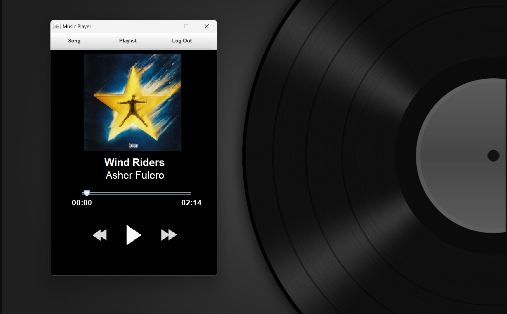

# Scotify - Java Music Player

Scotify is a music player application built using Java. It utilizes various JAR libraries for audio playback and a graphical user interface (GUI) designed with Java Swing and AWT.

## Features
- Create and manage playlists
- Play, pause, and skip songs
- Create and manage playlists
- Display album artwork and song details
- User-friendly GUI with custom styling
- Supports multiple audio formats using external JAR libraries

## Technologies Used
- **Java Swing & AWT**: For creating the graphical interface
- **JLayer (mp3spi, tritonus)**: For playing MP3 files
- **Other JAR Libraries**: Additional dependencies for enhanced audio processing

## Installation
1. Clone this repository:
   ```sh
   git clone https://github.com/yourusername/Scotify.git
   ```
2. Open the project in IntelliJ IDEA (or any Java IDE).
3. Ensure you have the required JAR files in the `lib/` folder and added to the project classpath.
4. Compile and run the `Main.java` file.

## Screenshot


## How to Use
- **Play/Pause Button**: Start or pause the song
- **Next/Previous Buttons**: Navigate between songs
- **Volume Slider**: Adjust the volume
- **Playlist Section**: View and select songs

## Contributing
Feel free to fork this repository and enhance Scotify with new features! Pull requests are welcome.

## License
This project is open-source and available under the [MIT License](LICENSE).

